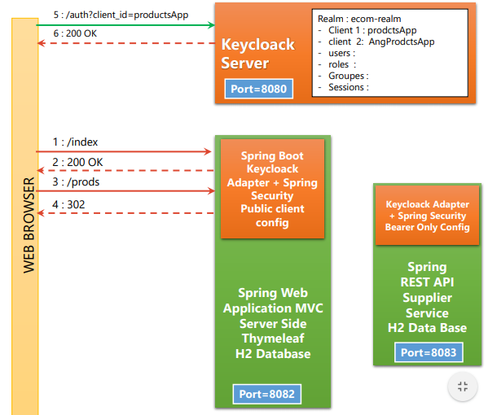
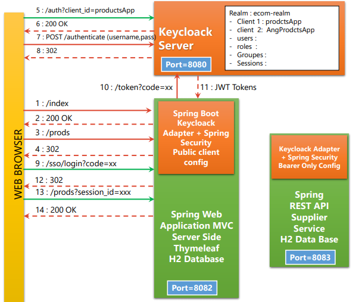
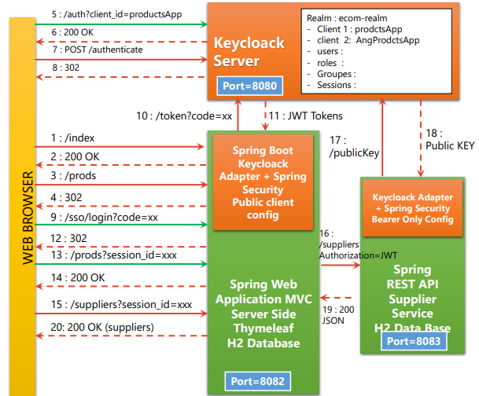

# Security-of-Microservices-Keycloak
Security of Microservices using Keycloak for the part (security, authentication) and thymeleaf for the display part

# Application architecture

  

The system consists of:

• A Spring MVC Front end Web application, Server side which allows you to manage products and suppliers. The products are stored in an H2 database and the suppliers can be accessed remotely in a micro service.

• A Spring Boot Micro Service to manage suppliers

• A Front Web Thymeleaf applications allowing to manage suppliers

• The management of products and suppliers is secure for the two Frontend applications, by an SSO authentication system based on Keycloak Server

1. The Client Attempts to access a resource not protected (http: // localhost: 8082 / index)
2. The Server manages the HTML code of the view by using the TemplatesThymeleaf engine and send it to the Browser
3. The Client requests a protected resource (http: // localhost: 8082 / prods)
4. Keycloack Adapter sends uen to the browser redirection to Keycloack Server for authenticate with clientID url parameter (302: http: // localhost: 8080 / auth? clientID = productsApp)
5. The Browser sends a request to the server Keycloack to request the form authentication: http: // localhost: 8080 / auth? clientID = productsApp
6. Keycloack sends the Form to the Browser authentication (200 OK)

7. The customer enters his username and password and send a post to keycloack
8. Keycloack verifies the identity of the user and opens a user session, then sends a redirection to the application with a parameter code representing the user's session: 302: http: / localhost: 8082 / sso / login? code = xxxxx
9. The Browser sends a Get to / sso / login exposed via the application's keycloack adapter
10. The application sends a GET to the server keycloack to retrieve the token authentication representation of the identity and client session by sending the code of the session
11. The application retrieves the JWT and opens a session for the client
12. The application sends a redirection to the protected resource requested with Session_ID of the user in the form of a Cookie (302: http: // localhost: 8082 / products)
13. The Browser requests the resource again protected by sending the SessionID
14. The application checks if the user's role is allows access to this resource and sends it.

15. The authenticated Client requests the application a protected resource / suppliers. Implemented in a remote micro service also as a Protected REST API by a Keycloack and Spring Adapter security in bearer only mode.
16. The application sends the request to the service remote Suppliers Service by sending the token User session JWT using KeyCloackREstTemplate which derives from Spring's RestTemplate.
17. To check the validity of the JWT token, the micro service needs the public key it get sending a request to the Keycloack server.
18. The Keycloack server provides the microphone services Suppliers the public key to verify the signature of the token. And then check JWT claims
19. The Micro service returns the result to the Web Frontend application
20. The application sends the results to the web browser.

# Access Token VS RefreshToken

## • Access Token:

   - Contains the information necessary to directly access a resource.

   - In other words, when a client transmits an access token to a server managing a resource, this server can use the information       in the token to decide whether the client is authorized or not.
   - Access tokens generally have an expiration date and are short lived.

## • RefreshToken:

   - Contains the information necessary to obtain a new Access Token.

   - In other words, whenever an access token is required to access a specific resource, a client can use the Refresh Token to           obtain a new Access Token issued by the authentication server.

   - Common use cases include

   - Obtaining new access tokens after the expiration of the old ones,

   - Access to a new resource for the first time.

   - Discount tokens can also expire but have a rather long lifespan.

   - Refresh tokens generally have strict storage requirements to ensure that they do not leak.

   - They can also be blacklisted by the authorization server.
